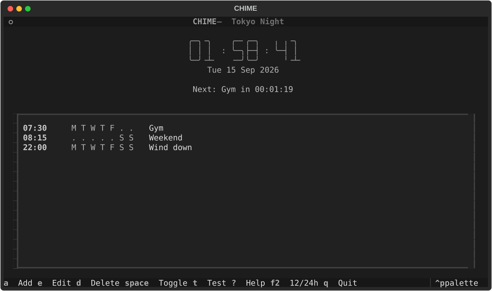
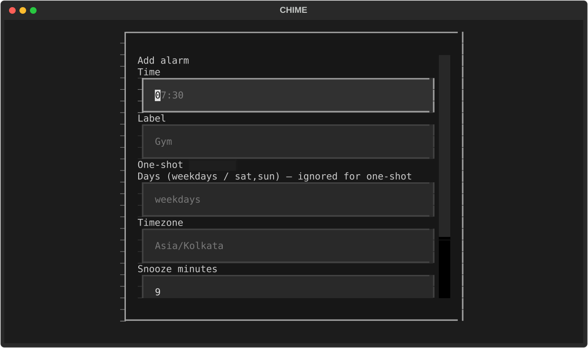
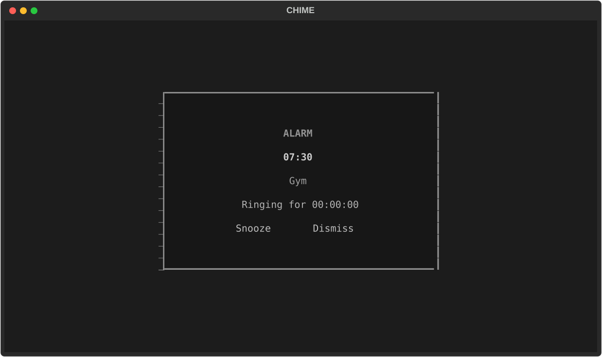
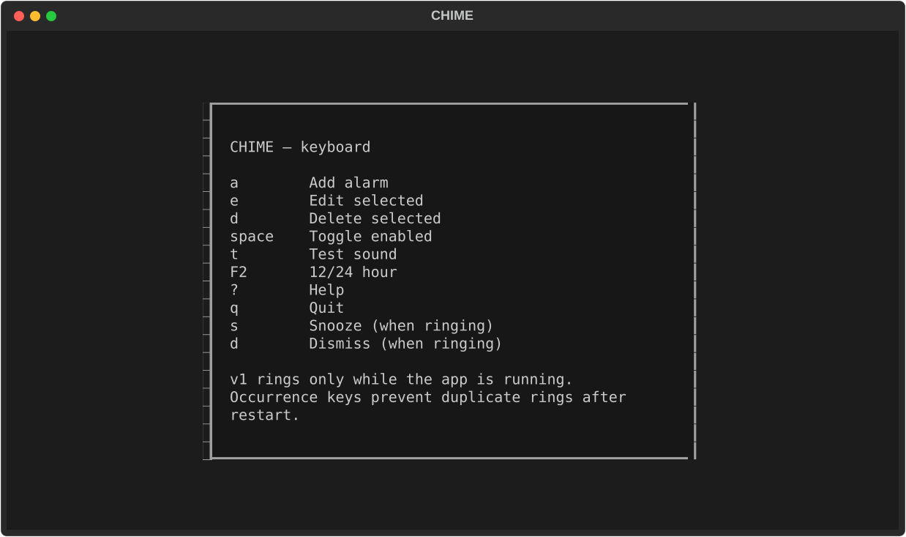

# CHIME

Terminal-native alarm clock for Windows, macOS, and Linux.

CLI + TUI only. **No web UI, no React, no database.** Alarms are stored in a
small JSON file on disk. **Version 1 rings only while the app is running.**

[](https://github.com/vinothhacks/chime/actions/workflows/ci.yml)

## Screenshots

Main screen — time is the dominant element; ON/OFF is written as text:



Add / edit alarm:



Ringing (visual ring is mandatory; audio is best-effort):



Help generated from the same bindings as the footer:



## Install

```bash
uv sync
uv run chime --help
```

Python 3.11+. The distribution name on PyPI would be `chime-alarm` (the name
`chime` is already taken); the command is still `chime`.

## CLI

```bash
chime                          # open the TUI
chime add 07:30 --once -l Gym
chime add 07:30 --days weekdays -l Gym
chime add 08:15 --days sat,sun -l Weekend
chime list
chime list --json
chime rm <id>
chime on <id>
chime off <id>
chime test-sound
chime doctor
```

`--json` prints JSON only on stdout.

Override the store location with `--data-dir` or `CHIME_DATA_DIR`. Override the
default timezone with `CHIME_TIMEZONE`.

## How ringing works

The schedule definition is not runtime state. Each due moment gets a
deterministic **occurrence key** (`alarm id + local date + local time + DST fold`).
Chime **claims that key, persists it, then rings**. A crash after a successful
claim will not ring the same occurrence again.

- Grace window: 5 minutes (a laptop that wakes 2 minutes late still rings).
- After grace: marked missed, never rings late.
- Spring-forward missing times are skipped.
- Fall-back ambiguous times fire once (`fold=0`).
- Snooze is a runtime reminder, not a new alarm (default 9 minutes, max 3).
- Dismissing a one-shot alarm disables it.
- Quit while ringing confirms as dismiss in v1.

## Tests

```bash
uv sync --group dev
uv run pytest -q
uv run ruff check
uv run mypy
```

Tests inject a fake clock. CI does not play audio.

## Record a demo

See [docs/SCREEN-RECORDING-SCRIPT.md](docs/SCREEN-RECORDING-SCRIPT.md).

Design thinking: [docs/CHIME-REFINED-DESIGN.md](docs/CHIME-REFINED-DESIGN.md).

## License

MIT
